# Guia webStory #
> **Objetivo**
> * Comprender los conceptos básicos del entorno de programacion Node.js, haciendo uso de su lenguaje JavaScript.
> * Crear un proyecto haciendo uso de Node.js y apoyado por diferentes dependencias como : Express, Socket.io, Nodemon, etc.

> **Requisitos**
> * PC (en esta guia se usa linux).
> * Tener Node.js y npm pre-instalados.
> * Editor de texto o IDE.

## Guia paso a paso ##
  **1**: Crear una carpeta “webStory”, donde se alojara el proyecto.
  
  **2**: Abrimos una terminal y nos ubicamos en la carpeta **webStory**, luego ejecutamos en la consola el comando `npm init -y` (el -y es  para que tenga la configuración por defecto).
  
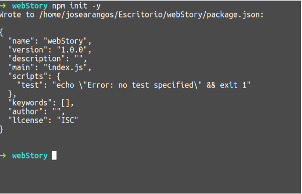

**3**: Ahora instalamos algunas librerías necesarias por medio de los siguientes comandos ejecutados dentro de la carpeta.

* `npm install express -S`
* `npm install body-parser -S`
* `npm install socket.io -S`
* `npm install nodemon -D` (el D es para que nodemon quede en  "devDependencies")
* `npm install cors -S`
* `npm install mongoose -S`

**4**: Al final nuestro package.json nos debe quedar con la siguiente estructura:

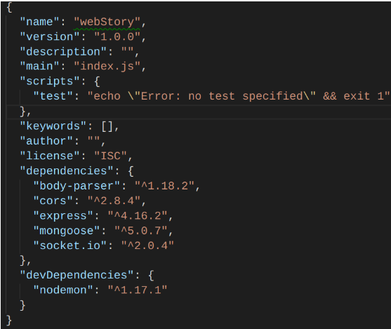

**5**: Creamos la estructura de carpetas: **webStory/server, webStory/server/model, webStory/public**:

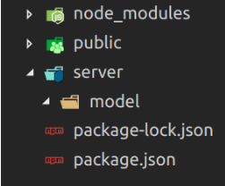

**6**: Creamos el archivo .js en server: **webStory/server/app.js**

**7**: Y en model creamos el archivo **webStory/model/word.js**

**8**: En la carpeta **webStory/public** descargamos los archivos del siguiente enlace:

**9**: En la carpeta **webStory/public** descargamos los archivos del siguiente enlace:

**10**: Configuramos el archivo **package.json** para no estar reiniciando el servidor cada que tengamos un cambio, en la parte de **scripts** ponemos la siguiente línea: **“start”:”nodemon server/app.js”**

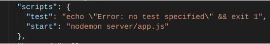

**11**: Ahora vamos a iniciar mongo, entramos a modo súper usuario escribiendo en la terminal `sudo su`,  luego la contraseña, que para este dojo es **“dojonode”** y luego ejecutamos el comando  `mongod`.

**12**: Vamos al archivo **webStory/model/word.js** y agregamos las siguientes líneas:

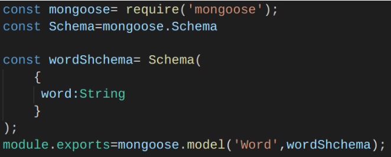

**13**: Dentro de **webStory/server/app.js** importamos las dependencias instaladas y el modelo:

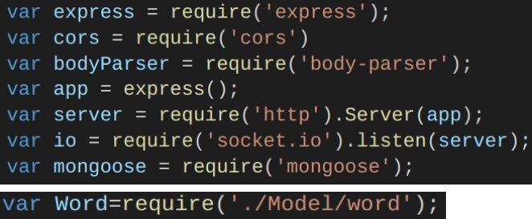

**14**: Traemos la base de datos y establecemos el puerto para nuestra aplicación:

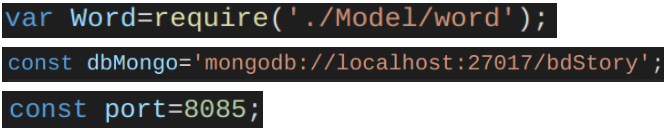

**15**: Cargamos a nuestra aplicación las siguientes funcionalidades, Creamos variable para nuestra historia:

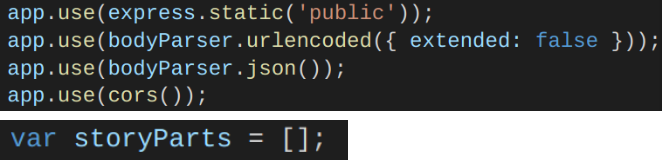

**16**: Aquí nos conectaremos conectaremos con la base de datos de mongodb:

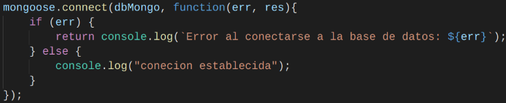

**17**: Creamos el servicio POST para ingresar nuevas palabras a la base de datos de palabras:

**18**: Creamos el servicio GET para traer todas las palabras de nuestra base de datos

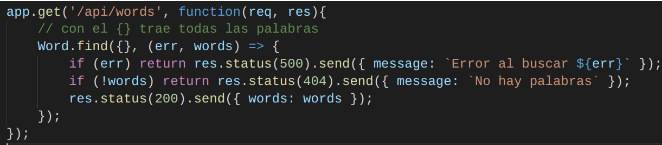

**19**: Para cuando nuestros sockets se conectan, hacemos la siguiente función. En ella también cubrimos lo que ocurre cuando una nueva frase es ingresada por uno de ellos y posteriormente se asigna la nueva palabra.

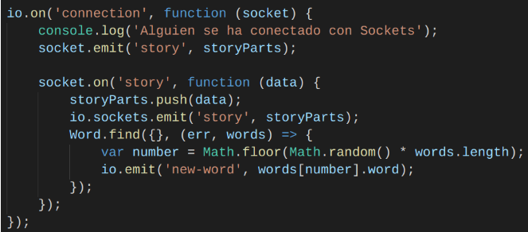

**20**: Colocamos a escuchar el servidor por el puerto previamente definido, haciendo uso de la función listen como se muestra a continuación:

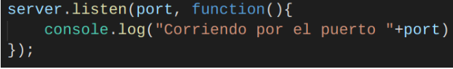

**21**: Para correr nuestro servidor, ejecutamos en la consola el siguiente código: `npm start`
Luego en el navegador, vamos a **localhost:puertodefinido**

